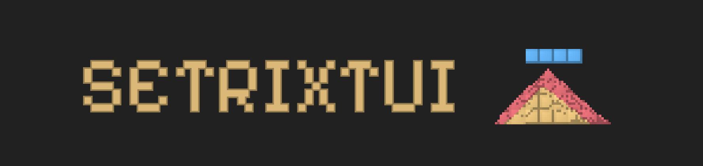
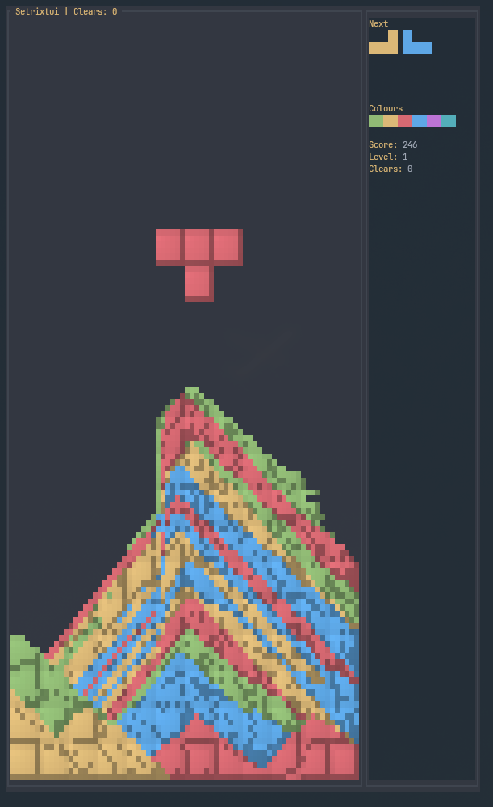

<div align="center">

  

  **Setrixtui**

  

  A terminal puzzle game: falling blocks that turn into sand. Clear lines by connecting one colour from edge to edge.

</div>

---

## Overview

Setrixtui is a Setris/Sandtrix-style game in the terminal. Place coloured blocks; when they lock, they turn into sand. Clear lines by making a single colour connect the **left edge to the right edge** (8-neighbour, path can be diagonal). Matching piece colours and completing those spans scores points; remaining sand falls under gravity.

## Requirements

- Rust 1.86+ (ratatui 0.30)
- Edition 2024

## Installation

### Cargo (Recommended)

```bash
cargo install setrixtui
```

Or build from source:

```bash
cargo build --release
./target/release/setrixtui
```

### Nix (flake)

Run without installing:

```bash
nix run github:Mjoyufull/setrixtui
```

install from github:

```bash
nix profile add github:Mjoyufull/setrixtui
```

## Quick start

```bash
./target/release/setrixtui
```


https://github.com/user-attachments/assets/2f575220-b1a0-4590-8472-b52333a304dc


By default you get the main menu (difficulty, mode, **autoplay**, **auto-restart**), then play. Endless mode and easy difficulty are selected by default. Use `--theme ./theme.theme` for your theme (otherwise the built-in One Dark is used).

Start without the menu:

```bash
./target/release/setrixtui --no-menu
```

With **autoplay** (Bot* plays the game) and **auto-restart** on game over for it to keep playing:

select 
```bash
setrixtui --autoplay
# or: -r / --ar
```
**bot kinda sucks rn
Help: **`-h`** / **`--h`** for short help, **`--help`** / **`--Help`** for full tree-style help with controls.

Custom playfield and options:

```bash
setrixtui --width 10 --height 24 --theme ./onedark.theme
setrixtui -m timed --time-limit 180 -d hard --no-animation
```

Playfield size is in **grid cells** (columns × rows). Default is 10×24. The game sizes the board to fit your terminal: in the menu, zooming out gives a larger playfield (up to 12×28); during play, the size is fixed. If the terminal is small, the board is reduced so everything fits.

**Game over:** **R** restart, **Q** quit.

## Layout



- **Playfield** (left, bordered): each block is 6×6 “grains”; the board uses half-blocks (▀) so two grain rows map to one terminal row.
- **Sidebar** (24 cols): **next-piece preview** with exact colours (1–3 pieces depending on difficulty), six sand colours, score, level, and in timed mode the remaining time. When autoplay is on, the next area shows an **AUTOPLAY** indicator instead.

Rough size: playfield needs `(width×6 + 2)` columns and `(height×3 + 2)` rows including border, plus 24 columns for the sidebar.

## Modes

| Mode     | Description |
|----------|-------------|
| **Endless** (default) | Play until stack overflow. **R** restart, **Q** quit. |
| **Timed** (`-m timed`, `--time-limit SECS`) | Score as much as you can before time runs out. **R** or **Q** when time’s up. |
| **Clear40** (`-m clear40`, `--clear-lines N`) | Goal: clear N lines (default 40) in as little time as possible. Once you reach N you keep playing until stack overflow; your best is the most lines cleared in a run. Time to N and total time are shown. |

## Controls

Movement keys repeat when held. Normal and vim-style bindings are supported.

| Action     | Normal        | Vim    |
|------------|---------------|--------|
| Left       | ←             | h      |
| Right      | →             | l      |
| Rotate CW  | ↑             | k / i  |
| Rotate CCW | (see --help)  | u      |
| Soft drop  | ↓             | j      |
| Hard drop  | Enter / Space | Space  |
| Pause      | p             | p      |
| Quit       | q / Esc       | q      |

**P** toggles pause. On game over or win: **R** restart, **Q** quit.

## Theme and colours

Themes are btop-style: `theme[key]="value"` with hex colours. See `onedark.theme` in the repo.

- **`--theme FILE`**: load colours from the file. Sand colours use keys such as `mem_box`, `title`, `cpu_end`, `cpu_box`, `net_box`, `hi_fg`; UI uses `meter_bg`, `div_line`, `main_fg`, `title`, `inactive_fg`. Hex values are used as-is.
- **No theme file**: built-in One Dark is used (same hex values as in `onedark.theme`).

`--palette high-contrast` or `--palette colorblind` overrides only the **sand** colours; the rest of the theme is unchanged.

## CLI summary

- **Playfield:** `--width COLS`, `--height ROWS` (default 10×24). Sized to fit the terminal.
- **Mode:** `-m endless | timed | clear40`. Timed: `--time-limit SECS`. Clear40: `--clear-lines N` (default 40).
- **Difficulty:** `-d easy | medium | hard` (gravity, next-piece count, and colour-repeat bias: 40% / 20% / 8%).
- **Theme:** `--theme FILE` (btop-style). `--palette normal | high-contrast | colorblind` for sand only.
- **Autoplay:** `--autoplay` (with `--no-menu`), or toggle in main menu. `--auto-restart` / `-r` to restart on game over (handy with autoplay).
- **Help:** `-h` / `--h` short help; `--help` / `--Help` full tree-style help.
- **Tuning:** `--tick-rate`, `--frame-rate`, `--spawn-delay-ms`, `--lock-delay-ms`, `--initial-level`, `--relaxed`, `--sand-settle`, `--no-animation`, `--no-menu`, `--high-color`.

Full list: `setrixtui --help` or `setrixtui -h`.

bit of help from gemini flash from antigravity and zeditor (struggled with codex still learning how to use AI)
